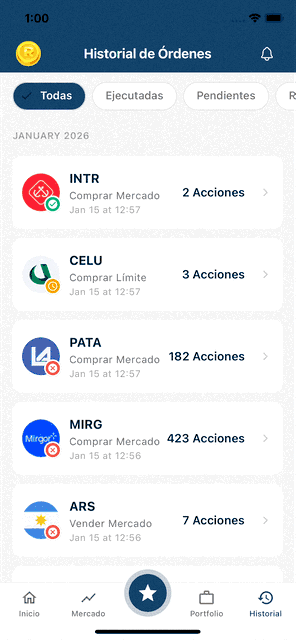

<p align="center">  </p> <h1 align="center">RUEDA</h1> <p align="center">“tu app de finanzas modernas”</p>

<p align="center">
  
  
  
</p>

---

## ¿Qué es RUEDA?

RUEDA es una aplicación mobile de trading construida con **React Native + Expo**.

La app incluye:

- **Dashboard financiero** con balance total y gráficos
- **Market** con búsqueda y filtros por tipo de activo
- **Portfolio** con posiciones y rendimiento detallado
- **Favoritos** para seguimiento de activos
- **Historial** completo de órdenes y transacciones
- **Trading** con órdenes de mercado y límite

**Stack principal:**  
React Native + Expo + TypeScript • Expo Router • React Native Paper • TanStack Query • i18next • AsyncStorage • Axios

---

## Diseño & UI (nota de proceso)

El diseño está inspirado en aplicaciones como **Robinhood**, priorizando una UI limpia, directa y con jerarquía visual clara.

Para acelerar el proceso visual:

- Se utilizaron **mockups generados con Google Stitch (IA)** como base
- Luego se realizó **ajuste manual** de layouts, spacing y jerarquía para llevarlos a un diseño consistente en React Native

> La IA se usó como herramienta de apoyo para acelerar iteraciones visuales, no como sustituto del diseño ni de la implementación manual.

---

## Arquitectura

El proyecto utiliza **Feature-Based Architecture**, organizando cada funcionalidad en módulos independientes (`src/features/*`).

Cada feature encapsula:

- componentes
- hooks
- estilos
- tipos
- lógica específica del dominio

Los elementos compartidos se centralizan en `src/shared/` para evitar duplicación.

```
app/ # Rutas (Expo Router)
├── _layout.tsx # Providers + Stack
└── (tabs)/ # Tabs principales
├── _layout.tsx
├── index.tsx
├── market.tsx
├── favorites.tsx
├── portfolio.tsx
└── history.tsx

src/
├── features/
│ ├── home/
│ ├── market/
│ ├── portfolio/
│ ├── favorites/
│ └── orders/
├── shared/
│ ├── components/
│ ├── hooks/
│ ├── theme/
│ └── utils/
```

---

### Routing

La navegación se implementa con **Expo Router** (file-based routing).

Los parámetros de navegación se pasan como IDs (`assetId`, `orderId`) para:

- evitar acoplar navegación con data compleja
- facilitar deeplinks y URLs simples

---

### i18n

La UI está internacionalizada con **i18next**.

Los textos se organizan por namespace por feature:

`home`, `market`, `portfolio`, `favorites`, `history`  
más un namespace compartido `common`.

---

### Persistencia

Favoritos e historial de órdenes se persisten con **AsyncStorage**.

Ante errores de lectura/escritura:

- se muestra feedback explícito al usuario (toast)
- se intenta recuperar el estado limpiando storage inválido

---

## Technical decisions & tradeoffs

Algunas decisiones clave tomadas durante el challenge, con sus tradeoffs explícitos:

| Tema          | Alternativas descartadas  | Decisión                    | Tradeoff y justificación                                                                                                                                                                        |
| ------------- | ------------------------- | --------------------------- | ----------------------------------------------------------------------------------------------------------------------------------------------------------------------------------------------- |
| Stack         | RN bare                   | **Expo**                    | Expo acelera el setup, manejo de assets y builds, permitiendo enfocarse en producto y arquitectura. **Tradeoff:** menor control fino del layer nativo, aceptable para el alcance del challenge. |
| Estructura    | Layered / por capas       | **Feature-based**           | Agrupar UI, lógica y estado por dominio mejora la lectura y el ownership de cada feature. **Tradeoff:** requiere disciplina para extraer correctamente lo compartido y evitar duplicación.      |
| Navegación    | React Navigation          | **Expo Router**             | File-based routing reduce boilerplate y hace las rutas más explícitas y predecibles. **Tradeoff:** para flujos extremadamente complejos puede requerir mayor planificación de estructura.       |
| Params        | Pasar objetos completos   | **Pasar IDs**               | Mantiene la navegación desacoplada del estado y evita problemas de serialización o data stale. **Tradeoff:** requiere resolver data adicional al entrar a cada pantalla.                        |
| Server-state  | Fetch manual              | **TanStack Query**          | Centraliza cache, refetch y estados de error/loading, simplificando la UI. **Tradeoff:** curva mínima de aprendizaje y dependencia adicional.                                                   |
| Estado global | Redux / Zustand           | **Context + hooks**         | El estado global es pequeño y acotado; Context evita boilerplate innecesario. **Tradeoff:** si el estado creciera en complejidad, sería necesario migrar a una store dedicada.                  |
| Styling       | Inline styles / CSS-in-JS | **StyleSheet**              | Ofrece buena performance y separación clara entre lógica y estilos. **Tradeoff:** menos ergonomía que soluciones utility-first o CSS-like.                                                      |
| UI kit        | UI completamente custom   | **React Native Paper**      | Permite avanzar rápido con componentes accesibles y probados. **Tradeoff:** algunos detalles visuales quedan condicionados por la librería.                                                     |
| i18n          | Strings hardcodeadas      | **i18next por feature**     | Mantiene consistencia y prepara el proyecto para escalar idiomas. **Tradeoff:** mayor cantidad de archivos y configuración inicial.                                                             |
| Persistencia  | Fallo silencioso          | **AsyncStorage + recovery** | Prefiero fallas explícitas y recuperación de estado para evitar bugs silenciosos. **Tradeoff:** más lógica defensiva y código adicional.                                                        |
|               |

---

## Configuración de entorno

La aplicación se conecta a una API REST para obtener datos.

Crear un archivo `.env` a partir del ejemplo

```bash
API_BASE_URL=https://your-api-endpoint.com
```

## Instalación local

```bash
# 1) Clonar el repositorio
git clone https://github.com/TommStark/rueda.git
cd rueda

# 2) Instalar dependencias
yarn

# 3) Configurar variables de entorno
cp .env.example .env
# Editar .env con las configuraciones necesarias

# 4) Iniciar el proyecto
yarn start


# Ejecutar en:

Expo Go (QR)

simulador iOS

emulador Android
```

## Scripts Disponibles

```bash
yarn lint:check
yarn lint
yarn format:check
yarn format
yarn typecheck
yarn test

yarn quality
yarn quality:fix

```

## Requisitos

Node.js 20+

iOS: iOS 13+ / Xcode 14+

Android: API 21+

---
